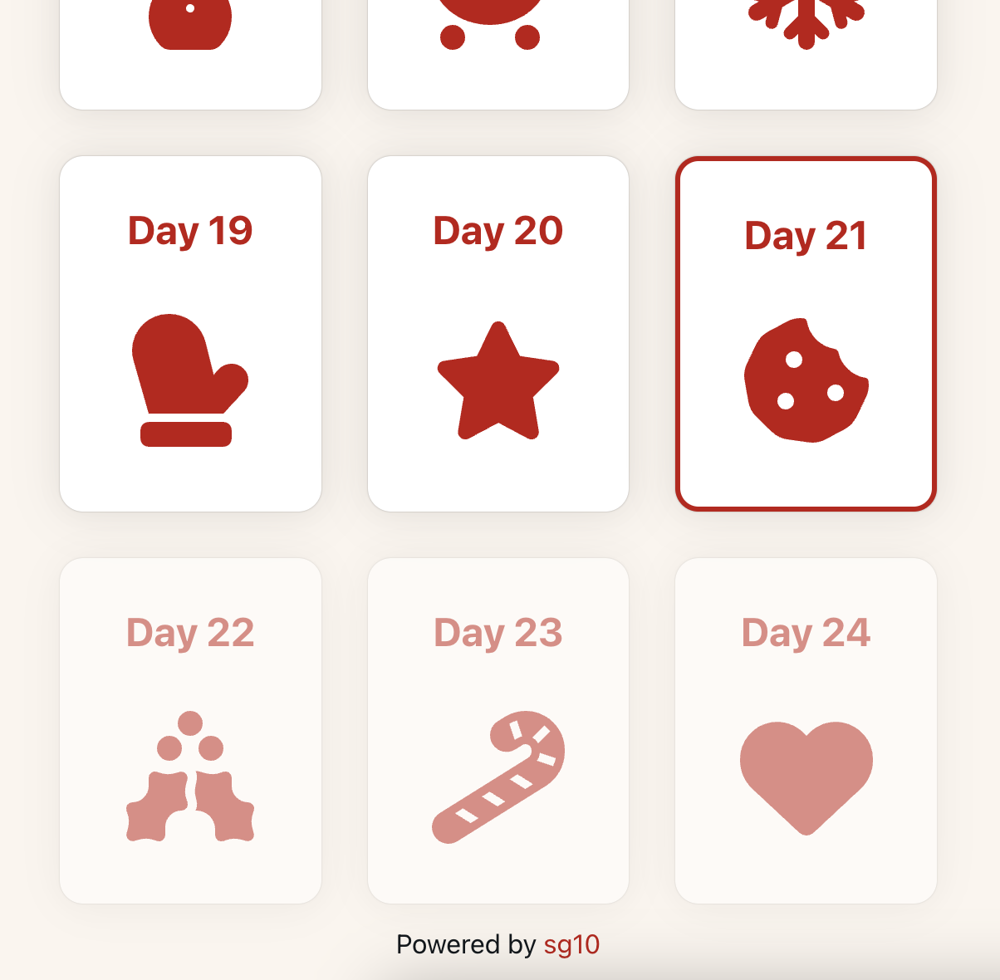
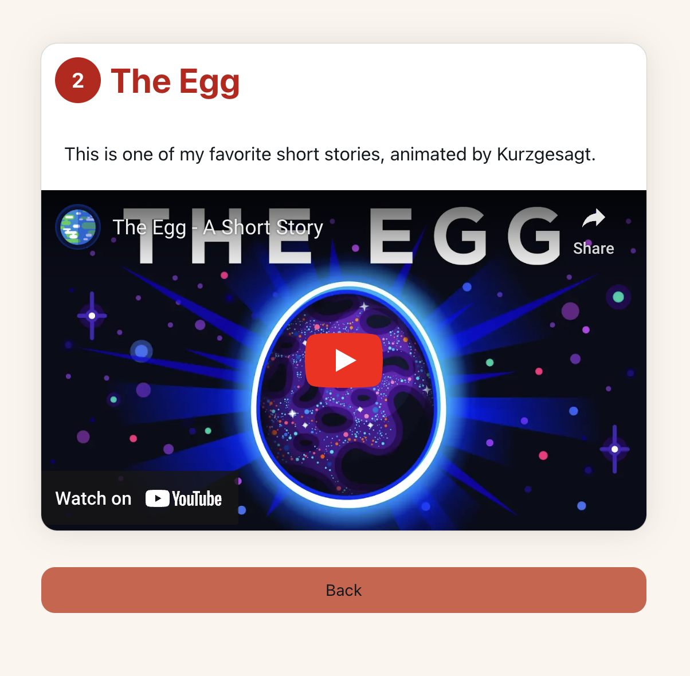

# Next.js Advent Calendar

This is a small advent calendar web app that allows to create and populate 24 windows with digital content to make friends, family and strangers happy during advent.






## Features

- multiple advent calendars
- various content types: image, link, YouTube embed, Spotify embed, video embed, quiz
- (hacky) editor to populate the calendars with content


## Technologies Used

- [Next.js 13](https://nextjs.org/docs/getting-started)
- [NextUI v2](https://nextui.org/)
- Firestore
- [Tailwind CSS](https://tailwindcss.com/)
- [Tailwind Variants](https://tailwind-variants.org)
- [TypeScript](https://www.typescriptlang.org/)
- [Framer Motion](https://www.framer.com/motion/)
- [next-themes](https://github.com/pacocoursey/next-themes)


### Install dependencies

```bash
npm install
```

### Run the development server

```bash
npm run dev
```

## License

Licensed under the [MIT license](https://github.com/nextui-org/next-app-template/blob/main/LICENSE).
